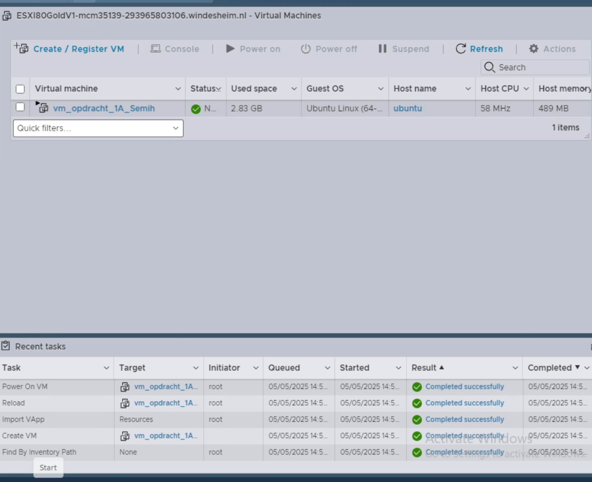

# Opdracht 1A 
(ESXi) Maak een terraform manifest voor 1 Ubuntu VM met 1 vcpu en 1024MB geheugen. Je zult zien dat de VM start en dat via de remote console van ESXi een prompt kunt zien. Maar je kunt er nog niks mee… Daarom mag je de VM verwijderen. De code bewaar je wel.

## 2.1 Gebruik gemaakt van deze bronnen:

https://leren.windesheim.nl/d2l/le/lessons/98305/topics/1223765

https://chatgpt.com/share/681cb3c0-52b4-8002-9184-8180f7d01dc2

# 2.2 Bestandenstructuur en toelichting 

🔹 providers.tf

In dit bestand definieer je welke cloud- of virtualisatieproviders Terraform moet gebruiken.

🔹 main.tf

In dit bestand staan de infrastructuurdefinities (VMs, netwerken, etc.)

# 2.3  Opdracht 1A resultaat:
Zie script in main.tf

Eindresultaat = 




## 🧪 Terraform Commands

Voor het uitvoeren van beide deployments gebruik je de standaard Terraform-commando’s:

```bash
terraform init
terraform apply
