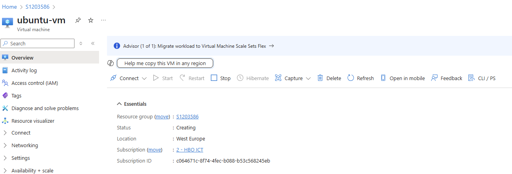

# Opdracht 1B 
Maak een terraform manifest voor 1 Ubuntu VM, gebaseerd op de Standard_B2ats_v2 sizing.

## 2.1 Gebruik gemaakt van deze bronnen:

https://leren.windesheim.nl/d2l/le/lessons/98305/topics/1223765

https://chatgpt.com/share/681cb3c0-52b4-8002-9184-8180f7d01dc2

# 2.2 Bestandenstructuur en toelichting 

🔹 variables.tf

Deze variabelen zorgen ervoor dat de configuratie makkelijk herbruikbaar is, zonder hardcoded waardes.

🔹 terraform.tfvars

In dit bestand worden de waardes toegekend aan de variabelen die zijn gedefinieerd in variables.tf.

🔹 providers.tf

In dit bestand definieer je welke cloud- of virtualisatieproviders Terraform moet gebruiken.

🔹 main.tf

In dit bestand staan de infrastructuurdefinities (VMs, netwerken, etc.)

#   2.3  Opdracht 1B eindresultaat:
Zie script in main.tf

Eindresultaat = 

